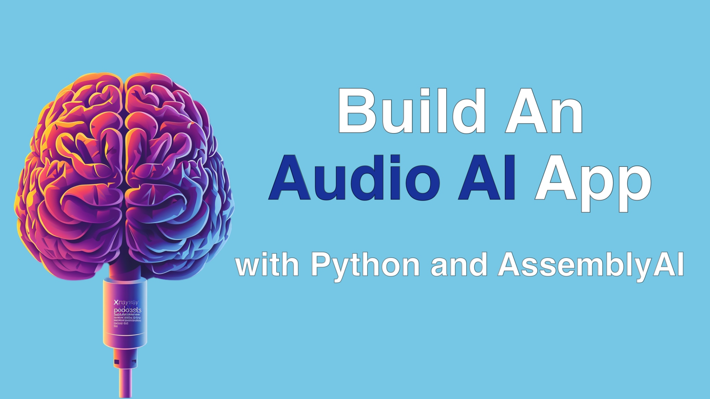

# Audio AI with AssemblyAI Course

If you work with audio and video content, a whole new world of possibilities has opened up with the advent of AI. Now that it is nearly instant and free to extract highly accurate text from spoken word. And with that text, we can expand the possibilities in many directions. In this course, we will build a realistic and real-world app working with audio from podcasts. We will summarize them, generate transcripts, and even create specialized GPTs for that content. All of that will be done with amazing technologies such as FastAPI, Pydantic, MongoDB, HTMX and AssemblyAI.

See the [full course details on talkpython.fm](https://training.talkpython.fm/courses/build-an-audio-ai-app-with-python-and-assemblyai) and sign up for the **free course**.
